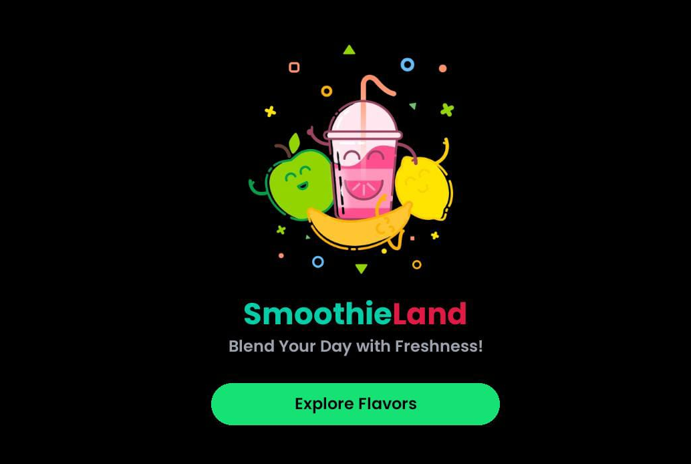

# Introducing SmoothieLand 



This is an [Expo](https://expo.dev) project created with [`create-expo-app`](https://www.npmjs.com/package/create-expo-app).

## Get started (Dev mode)

1. Install dependencies

   ```bash
   npm install
   ```

2. Start the app

   ```bash
    npx expo start
   ```

To get the .apk build (for android), go to: [smoothieLand.apk](https://expo.dev/artifacts/eas/ehAX2oXvPC7YcuVXuhc1fM.apk).
*Note that this .apk build is not officially uploaded to any app store; you may therefore encounter challenges while installing it.*

Should you choose to try it out and then get an error: "App not installed" (on android); then try:
- Disabling play protect on playstore.
- Install on SD card.
- Allow apps downloaded from browser to install.

If it still won't install, then stay put and keep an eye open for an official one (both android and ios versions).
